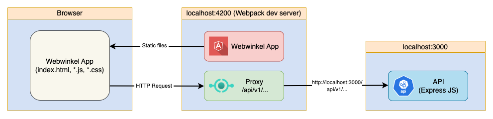

# Webwinkel App
This is a simple web-shop application. The main goal is to delve into frontend, backend and CI/CD technologies while constructing a web based end-to-end application. <br>
The application is being deployed and running in Glitch-platform: https://winkel-app.glitch.me

## Used technology
* FE: Angular (18.1.3)
* BE: Expressjs (Nodejs-based mock API server)

#### Used Angular fetures
* Components (both modules and standalone)
* HTTP Client
* Interceptors
* Routing
* Authentication and route protection
* Observable
* Services
* Dependency injection
* Forms:
  * Template-driven Forms
  * Reactive Forms
* Pipes
## Roles and Use cases
A user is authorised depending on a `role`, three roles are supported by the app
  * Customre
  * Employee
  * Admin
### Customer
Customre - a user who wants to make purchase
Login e-mail | Password
--- | --- 
anna@dd.com | secret1 

### Employee
Employee - an internal users who can manage list of products available online
Login e-mail | Password
--- | --- 
max@dd.com | secret2 

### Admin
Admin - an interan user who can manage customers and products
Login e-mail | Password
--- | --- 
admin@dd.com | secret3 

## CI/CD
`GitHib Actions` feature is used for CI/CD. <br>
CI is triggered each time when a `feature` branch is updated - it builds apps and run tests.<br>
CD is triggered by any commit to `main` branch, normally after mergninfg `feature` branch into `main` when completing pull requests. CD deploys both FE and BE (API) into Glitch-platform.


## Dev-environment
In the dev-env both FE-app and BE-API can be started up on the same computer.
### Diagram


### Use Angular dev-server proxy
Angular allows to configure CLI dev-server proxy. This is an example of `proxy.conf.json` configuration:
```
{
   "/api/v1/products": {
      "target": "http://localhost:3000",
      "secure": false
   }
}
```
Use the following command to run dev-proxy:
```
ng serve --proxy-config proxy.conf.json
```
This configuration is ONLY for a development purpose, it should not be used in a production environment.

### How to start
The project includes two parts: back-end and front-end. Back-end is an API-server based on Expressjs
#### API server
First the API server should be started
```
cd Webwinkel/BE/express-api
node products-api.js
```
This will start the server on the port 3000

#### Angular app
When API-server is up and running, the FE-app can be staarted:
```
cd Webwinkel/FE/winkel-app
ng serve --proxy-config proxy.conf.json
```
This will start the Anfular app on the localhost port 4200: `http://localhost:4200/`

## Resources
* [Angular docs](https://v17.angular.io/docs)
* [Typescript docs](https://www.typescriptlang.org/docs/)
* [Bootstrap](https://getbootstrap.com/docs/5.3/content/tables/)
